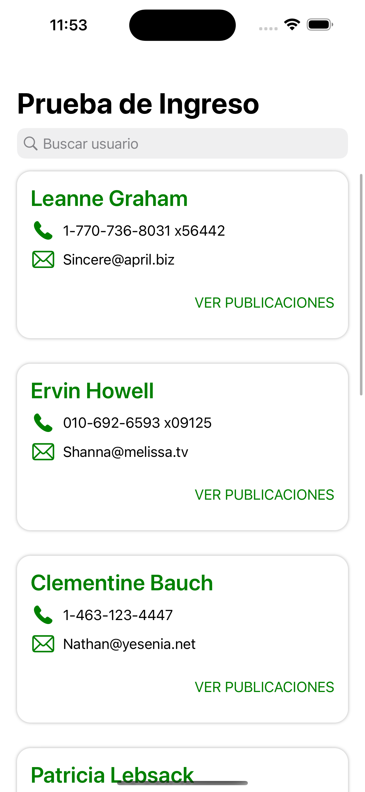
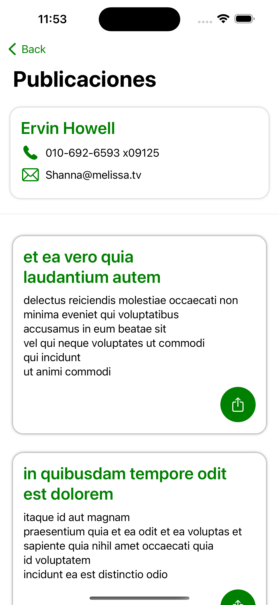

# Usuarios

La aplicación obtiene una lista de usuarios y sus publicaciones desde el api `https://jsonplaceholder.typicode.com`.

## Información

- Alamofire, como dependencia para el consumo de las API.
- CoreData, para la persistencia de datos localmente.
- Para la parte gráfica (View) se utilizo solo SwiftUI.
- Utilice el patrón MVVM.
- El "property list" donde se configura la ruta para los servicios esta en `Users/Models/Resources/Config.plist`
- Pruebas unitarias
- Pruebas funcionales

## Demostración

| Lista de usuario | Filtro de búsqueda | Publicaciones |
|------------------|--------------------|---------------|
| |  |  |

## Puebas unitarias y funcionales

